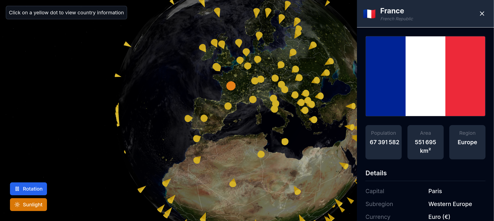

# Atlas

Atlas is a simple interactive web application for visualizing the world map and its countries. It allows users to explore the world map, view country names, and get information about each country.
This application was built using React, TypeScript, Tailwind CSS and Three.js.

## Data Source

Two public APIs are used in this project:
- [REST Countries API](https://restcountries.com/)
- [geojson.xyz](https://geojson.xyz/)

## Author

This project was created by [KwikKill](https://github.com/KwikKill) as a personal project to learn and practice React and Three.js. The project is open-source.
